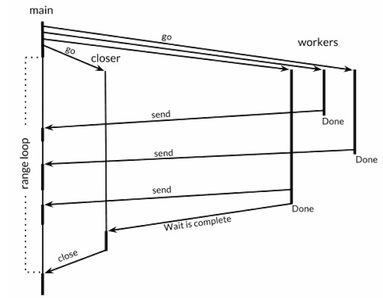

并发支持是Go语言的强力特性之一，Go语言中的并发程序可以用两种手段来实现。一是基于goroutine和channel的“顺序通信进程”(communicating sequential processes)或被简称为CSP。二是基于多线程共享内存的传统的并发模型。

### 1. 基于Goroutine和channel的CSP并发方式  
CSP是一种现代的并发编程模型，在这种编程模型中值会在不同的运行实例(goroutine)中传递信息，尽管大多数情况下仍然是被限制在单一实例中。

在Go语言中，每一个并发的执行单元叫作一个goroutine(轻量级线程)(实现上类似于JavaScript Generators[[1](https://developer.mozilla.org/en-US/docs/Web/JavaScript/Reference/Global_Objects/Generator)] 和[[2](https://docs.python.org/3.7/tutorial/classes.html#generators)]

当一个程序启动时，其主函数即在一个单独的goroutine中运行(main goroutine)。新
的goroutine会用go语句来创建。go语句会使其语句中的函数在一个新创建的goroutine中运行。而go语句本身会迅速地完成。
``` go
f() // call f(); wait for it to return

go f() // create a new goroutine that calls f(); don't wait
```

#### (1). 并发的循环
如下例程是一种在并行时循环迭代的常见并发模型
```
// makeThumbnails6 makes thumbnails for each file received from the channel.
// It returns the number of bytes occupied by the files it creates.
func makeThumbnails6(filenames <-chan string) int64 {
    sizes := make(chan int64)
    var wg sync.WaitGroup // number of working goroutines
    for f := range filenames {
        wg.Add(1)
        // worker
        go func(f string) {
            defer wg.Done()
            thumb, err := thumbnail.ImageFile(f)
            if err != nil {
                log.Println(err)
                return
            }
            info, _ := os.Stat(thumb) // OK to ignore error
            sizes <- info.Size()
        }(f)
    }
    // closer
    go func() {
        wg.Wait()
        close(sizes)
    }()

    var total int64
    for size := range sizes {
        total += size
    }
    return total
}
```
下图描述了makethumbnails6函数中并发循环的事件序列


#### (2). 基于select的多路复用
goroutine无法在循环并发中等待多个channel并从每一个channel中接收信息，如果我们这么做的话，如果第一个channel中没有事件发过来那么程序就会立刻被阻塞，这样我们就无法收到第二个channel中发过来的事件。为了能够多路复用，需要使用select语句。
```
select {
    case <-ch1:
    // ...
    case x := <-ch2:
    // ...use x...
    case ch3 <- y:
    // ...
    default:
    // ...
}
```
上面是select语句的一般形式。和switch语句稍微有点相似，也会有几个case和最后的default
选择支。每一个case代表一个通信操作(在某个channel上进行发送或者接收)并且会包含一些
语句组成的一个语句块。一个接收表达式可能只包含接收表达式自身，或者包含在一个简短的变量声明中。select会等待case中有能够执行的case时去执行。当条件满足时，select才会去通信并执行
case之后的语句；这时候其它通信是不会执行的。一个没有任何case的select语句写作
select{}，会永远地等待下去。如果多个case同时就绪时，select会随机地选择一个执行，这样来保证每一个channel都有平等的被select的机会。
```
func PingPong() {
	ch := make(chan int, 1)
	for i := 0; i < 10; i++ {
		select {
		case x := <-ch:
			fmt.Println(x) // "0" "2" "4" "6" "8"
		case ch <- i:
		}
	}
}
```
#### (3). 并发退出
Goroutine被设计为只能自身退出，Go语言并没有提供在一个goroutine中终止另一个goroutine的方法，由于这样会导致goroutine之间的共享变量落在未定义的状态上。当关闭了一个channel并且消费掉了所有已发送的值，channel接收操作不会阻塞，之后的代码可以立即被执行，并且会产生零值。因此，可以通过关闭一个channel来进行广播。


### 2. 基于多线程共享内存并发方式
#### (1). sync.Mutex互斥锁 (<font color=red>**go里没有重入锁**</font>)
竞争条件指的是程序在多个goroutine交叉执行操作时，无法保证一致性。如下程序中对balance变量访问就存在竞争。我们可以用一个容量只有1的channel来保证最多只有一个goroutine在同一时刻访问一个共享变量。一个只能为1和0的信号量叫做二元信号量(binary semaphore)。
```
var (
    sema = make(chan struct{}, 1) // a binary semaphore guarding balance
    balance int
)
func Deposit(amount int) {
    sema <- struct{}{} // acquire token
    balance = balance + amount
    <-sema // release token
}
func Balance() int {
    sema <- struct{}{} // acquire token
    b := balance
    <-sema // release token
    return b
}
```
这种互斥很实用，而且被sync包里的Mutex类型直接支持。它的Lock方法能够获取到token(这
里叫锁)，并且Unlock方法会释放这个token：
```
import "sync"
var (
    mu sync.Mutex // guards balance
    balance int
)
func Deposit(amount int) {
    mu.Lock()
    balance = balance + amount
    mu.Unlock()
}
func Balance() int {
    mu.Lock()
    b := balance
    mu.Unlock()
    return b
}
```
每次一个goroutine访问bank变量时(这里只有balance余额变量)，它都会调用mutex的Lock方
法来获取一个互斥锁。如果其它的goroutine已经获得了这个锁的话，这个操作会被阻塞直到
其它goroutine调用了Unlock使该锁变回可用状态。此外，一个deferred Unlock即使在临界区发生panic时依然会执行，这对于用recover来恢复的程序来说是很重要的。defer调用只会比显式地调用Unlock成本高那么一点点，不过却在很大程度上保证了代码的整洁性。如果可能的话尽量使用defer来将临界区扩展到函数的结束。

#### (2). sync.Mutex读写锁
并行读取操作往往是安全的，在这种场景下我们需要一种特殊类型的锁，其允许多个只读操作并行执行，但写操作会完全互斥，这种锁叫作“多读单写”锁(multiple readers, single writer lock)。Go语言提供的这样的锁是sync.RWMutex。
``` go
var mu sync.RWMutex
var balance int
func Balance() int {
    mu.RLock() // readers lock
    defer mu.RUnlock()
    return balance
}
```
RWMutex需要更复杂的内部记录，所以会让它比一般的无竞争锁的mutex慢一些。RWMutex只有当获得锁的大部分goroutine都是读操作，而锁在竞争条件下(goroutine们必须等待才能获取到锁的时候)，RWMutex才是最能带来好处的。

#### (3). 内存同步 [[3](https://golang.org/ref/mem)]
在现代计算机中可能会有一堆处理器，每一个都会有其本地缓存(local cache)。为了效率，对
内存的写入一般会在每一个处理器中缓冲，并在必要时一起flush到主存。这种情况下这些数
据可能会以与当初goroutine写入顺序不同的顺序被提交到主存。像channel通信或者互斥量操
作这样的原语会使处理器将其聚集的写入flush并commit，这样goroutine在某个时间点上的执
行结果才能被其它处理器上运行的goroutine得到。缺少channel, mutex等显式的同步的情况下，编译器和CPU是可以随意地去更改访问内存的指令顺序(保证每一个goroutine自己的执行顺序一致)。

#### (4). sync.Once初始化
如果初始化成本比较大的话，那么将初始化延迟到需要的时候再去做就是一个比较好的选
择（例如单例模式）。一次性的初始化需要一个互斥量mutex和一个boolean变量来记录初始化是不是已经完成了；互斥量用来保护boolean变量和客户端数据结构。
```go
var mu sync.RWMutex // guards icons
var icons map[string]image.Image

// Concurrency-safe.
func Icon(name string) image.Image {
    mu.RLock()
    if icons != nil {
        icon := icons[name]
        mu.RUnlock()
        return icon
    }
    mu.RUnlock()
    
    // acquire an exclusive lock
    mu.Lock()
    if icons == nil { // NOTE: must recheck for nil
        loadIcons()
    }
    icon := icons[name]
    mu.Unlock()
    return icon
}
```
上面的代码有两个临界区。goroutine首先会获取一个读锁，查询map，然后释放锁。如果条
目被找到了(一般情况下)，那么会直接返回。如果没有找到，那goroutine会获取一个互斥锁。不
释放共享锁的话，也没有任何办法来将一个共享锁升级为一个互斥锁，所以我们必须重新检
查icons变量是否为nil，以防止在执行这一段代码的时候，icons变量已经被其它gorouine初始
化过了。

我们可以使用sync.Once来简化。sync.Once的Do方法需要接收初始化函数作为其参数。
``` go
var loadIconsOnce sync.Once
var icons map[string]image.Image

// Concurrency-safe.
func Icon(name string) image.Image {
    loadIconsOnce.Do(loadIcons)
    return icons[name]
}
```
每一次对 <font color="red">Do(loadIcons)</font> 的调用都会锁定mutex，并会检查boolean变量。在第一次调用时，变量的值是false，Do会调用loadIcons并会将boolean设置为true。随后的调用什么都不会做，但是mutex同步会保证loadIcons对内存产生的效果能够对所有
goroutine可见(这里其实就是指icons变量)。用这种方式来使用sync.Once的话，我们能够避免在变量被构建完成之前和其它goroutine共享该变量。

### 3. 竞争条件检测
Go的runtime和工具链为我们装备了一个复杂但好用的动态分析工具，竞争检查器(the race detector)。
只要在go build，go run或者go test命令后面加上-race的flag，就会使编译器创建一个你的应
用的“修改”版或者一个附带了能够记录所有运行期对共享变量访问工具的test，并且会记录下每一个读或者写共享变量的goroutine的身份信息。另外，修改版的程序会记录下所有的同步事件，比如go语句，channel操作，以及对(*sync.Mutex).Lock，(*sync.WaitGroup).Wait等等的调用[[3](https://golang.org/ref/mem)]。  
竞争检查器会检查这些事件，会寻找在哪一个goroutine中出现了这样的case，例如其读或者写了一个共享变量，这个共享变量是被另一个goroutine在没有进行干预同步操作便直接写入的。这种情况也就表明了是对一个共享变量的并发访问，即数据竞争。这个工具会打印一份报告，内容包含变量身份，读取和写入的goroutine中活跃的函数的调用栈。
``` go
func readwriter() {
	var count = 10
	// add
	go func() {
	    count++
	    fmt.Printf("add ...")
	}()
	go func() {
	    count--
	    fmt.Printf("add ...")
	}()
}
```

``` go
zhongxiao.yzx@MacBook-Pro:~/Workspace/dev/golang/src/zhongxiao.yzx$go run -race goroutine.go
add ...==================
WARNING: DATA RACE
Read at 0x00c42009c008 by goroutine 7:
  main.readwriter.func2()
      /Users/zhongxiao.yzx/Workspace/dev/golang/src/zhongxiao.yzx/goroutine.go:35 +0x3c

Previous write at 0x00c42009c008 by goroutine 6:
  main.readwriter.func1()
      /Users/zhongxiao.yzx/Workspace/dev/golang/src/zhongxiao.yzx/goroutine.go:31 +0x52

Goroutine 7 (running) created at:
  main.readwriter()
      /Users/zhongxiao.yzx/Workspace/dev/golang/src/zhongxiao.yzx/goroutine.go:34 +0x9c
  main.main()
      /Users/zhongxiao.yzx/Workspace/dev/golang/src/zhongxiao.yzx/goroutine.go:41 +0x2f

Goroutine 6 (finished) created at:
  main.readwriter()
      /Users/zhongxiao.yzx/Workspace/dev/golang/src/zhongxiao.yzx/goroutine.go:30 +0x7a
  main.main()
      /Users/zhongxiao.yzx/Workspace/dev/golang/src/zhongxiao.yzx/goroutine.go:41 +0x2f
==================
add ...Found 1 data race(s)
exit status 66
```

### 4. Goroutines和线程
#### (1).  堆栈分配比较
每一个OS线程都有一个固定大小的内存块(一般会是2MB)来做栈，这个栈会用来存储当前正
在被调用或挂起(指在调用其它函数时)的函数的内部变量。  
相反，一个goroutine会以一个很小的栈开始其生命周期，一般只需要2KB。一个goroutine的
栈，和操作系统线程一样，会保存其活跃或挂起的函数调用的本地变量，但是和OS线程不太
一样的是一个goroutine的栈大小并不是固定的；栈的大小会根据需要动态地伸缩。而
goroutine的栈的最大值有1GB，比传统的固定大小的线程栈要大得多，尽管一般情况下，大
多goroutine都不需要这么大的栈。

#### (2). 调度比较
OS线程会被操作系统内核调度。每几毫秒，一个硬件计时器会中断处理器，这会调用一个叫作scheduler的内核函数。这个函数会挂起当前执行的线程并保存内存中它的寄存器内容，检查线程列表并决定下一次哪个线程可以被运行，并从内存中恢复该线程的寄存器信息，然后恢复执行该线程的现场并开始执行线程。因为操作系统线程是被内核所调度，所以从一个线程向另一个“移动”需要完整的上下文切换，也就是说，保存一个用户线程的状态到内存，恢复另一个线程的到寄存器，然后更新调度器的数据结构。这几步操作很慢，因为其局部性很差需要几次内存访问，并且会增加运行的cpu周期。  
Go的运行时包含了其自己的调度器，这个调度器使用了一些技术手段，比如m:n调度，因为其会在n个操作系统线程上多工(调度)m个goroutine。Go调度器的工作和内核的调度是相似的，但是这个调度器只关注单独的Go程序中的goroutine。和操作系统的线程调度不同的是，Go调度器并不是用一个硬件定时器而是被Go语言"建筑"本身进行调度的。例如当一个goroutine调用了time.Sleep或者被channel调用或者mutex操作阻塞时，调度器会使其进入休眠并开始执行另一个goroutine直到时机到了再去唤醒第一个goroutine。因为因为这种调度方式不需要进入内核的上下文，所以重新调度一个goroutine比调度一个线程代价要低得多(基于线程和协程的调度)[[4](https://en.wikipedia.org/wiki/Coroutine)]。

Go的调度器使用了一个叫做GOMAXPROCS的变量来决定会有多少个操作系统的线程同时执行Go的代码。其默认的值是运行机器上的CPU的核心数，所以在一个有8个核心的机器上时，调度器一次会在8个OS线程上去调度GO代码。(GOMAXPROCS是前面说的m:n调度中的n)。在休眠中的或者在通信中被阻塞的goroutine是不需要一个对应的线程来做调度的。在I/O中或系统调用中或调用非Go语言函数时，是需要一个对应的操作系统线程的，但是GOMAXPROCS并不需要将这几种情况计数在内。
你可以用GOMAXPROCS的环境变量显式地控制这个参数，或者也可以在运行时runtime.GOMAXPROCS函数来修改它。我们在下面的小程序中会看到GOMAXPROCS的效果，这个程序会无限打印0和1。

``` go
for {
    go fmt.Print(0)
    fmt.Print(1)
}

$ GOMAXPROCS=1 go run hackerSched.go
111111111111111111110000000000000000000011111...
$ GOMAXPROCS=2 go run hackerSched.go
010101010101010101011001100101011010010100110...
```
在第一次执行时，最多同时只能有一个goroutine被执行。初始情况下只有main goroutine被执行，所以会打印很多1。过了一段时间后，GO调度器会将其置为休眠，并唤醒另一个goroutine，这时候就开始打印很多0了，在打印的时候，goroutine是被调度到操作系统线程上的。在第二次执行时，我们使用了两个操作系统线程，所以两个goroutine可以一起被执行，以同样的频率交替打印0和1。我们必须强调的是goroutine的调度是受很多因子影响的，而runtime也是在不断地发展演进的。

#### (3). 身份识别
在大多数支持多线程的操作系统和程序语言中，当前的线程都有一个独特的身份(id)，并且这个身份信息可以以一个普通值的形式被被很容易地获取到，典型的可以是一个integer或者指针值。
goroutine没有可以被程序员获取到的身份(id)的概念。


#### 参考资料
[1] [JavaScript Generator : https://developer.mozilla.org/en-US/docs/Web/JavaScript/Reference/Global_Objects/Generator](https://developer.mozilla.org/en-US/docs/Web/JavaScript/Reference/Global_Objects/Generator)

[2] [Python Generators : https://docs.python.org/3.7/tutorial/classes.html#generators](https://docs.python.org/3.7/tutorial/classes.html#generators)

[3] [The Go Memory Model : https://golang.org/ref/mem](https://golang.org/ref/mem)

[4] [Coroutine : https://en.wikipedia.org/wiki/Coroutine](https://en.wikipedia.org/wiki/Coroutine)