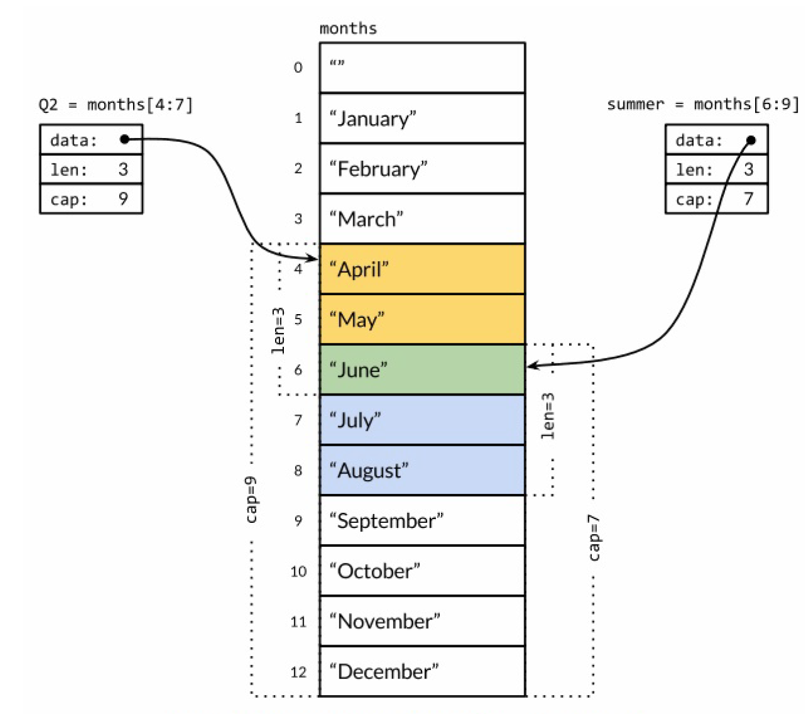
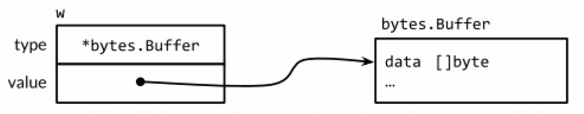
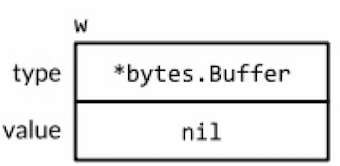
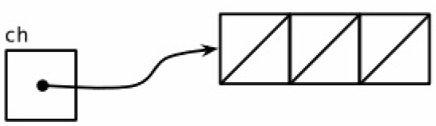
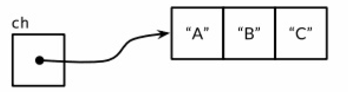

Go语言程序由基本的要素构成，包括Go语言数据类型，Go语言内置要素(标识符，关键字，字面量，操作数)等。

### Go语言数据类型
Go语言将数据类型分为四类：基础类型、复合类型、接口类型和引用类型。
#### 1. 基础类型
- 整数(intx, uintx, rune~int32, byte-uint8, uintptr~uint)
- 浮点数(float32, float64)
- 复数(complex64, complex128)
- 布尔(true, false)
- 字符串   
	一个字符串是一个<font color=red>**不可改变的字节序列**</font>(字符串可以包含任意的数据，包括byte值0，但是通常是用来包含人类可读的文本。文本字符串通常被解释为采用UTF8编码的Unicode码点（rune）序列)。内置的len函数可以返回一个字符串中的字节数目（不是rune字符数目），索引操作s[i]返回第i个字节的字节值。  
	一个原生的字符串面值形式是 rs := \`ddd\n\r\t\`，使用反引号 代替双引号。在原生的字符串面值中，没有转义操作；全部的内容都是字面的意思，包含退格和换行。  

	<font color=red>**rune**</font> 用来表示Unicode的code point(rune alias for int32)
	``` go
	var va rune
	fmt.Printf("%T\n", va) //int32
	```

	Go当中 string底层是用byte数组存的，并且是不可以改变的。
	``` go 
	s:="Go编程"
	fmt.Println(len(s))          // 8 中文字符是用3个字节存的
	len(string(rune('编')))      // 3
	fmt.Println(len([]rune(s)))  // 4
	``` 
	所以用string存储unicode的话，如果有中文，按下标是访问不到的，因为你只能得到一个byte。 要想访问中文的话，还是要用rune切片

#### 2. 复合类型
复合数据类型是以不同的方式组合基本类型构造出来的数据类型。Go有四种复合类型——数组、slice、map和结构体。  
数组和结构体是聚合类型,是有固定内存大小的数据结构。相比之下，slice和map则是动态的数据结构，它们将根据需要动态增长。  
1. 数组  
	数组是一个由固定长度的特定类型元素组成的序列。一个数组类型一般写作 <font color=red>**[LENGTH] T**</font>，其中LENGTH是数组标识字符串长度的常量，T是字符串中元素类型。

	```	
	var a [Const_Length] T //
	q := [...]int{1, 2, 3} // ... 由初始值推导
	```  
	如果一个数组的元素类型是可以相互比较的，那么数组类型也是可以相互比较的，这时候我们可以直接通过==比较运算符来比较两个数组，只有当两个数组的所有元素都是相等的时候数组才是相等的

<span id="SliceAnchor"></span>

2. Slice(切片) 
	slice是可以增长和收缩动态的变长的序列，序列中每个元素都有相同的类型。一个slice类型一般写作 <font color=red>**[]T**</font>，其中T代表slice中元素的类型；slice的语法和数组很像，只是没有固定长度而已。  
	一个slice由三个部分构成：指针、长度和容量。
	如下所示slice内存模型可见，slice值包含指向第一个slice元素的指针，因此向函数传递slice将允许在函数内部修改底层数组的元素。换句话说，复制一个slice只是对底层的数组创建了一个新的slice别名。 
	
	slice有如下生成方式:  
		- slice的切片操作s[i:j]，其中0 ≤ i≤ j≤ cap(s)，用于创建一个新的slice，引用s的从第i个元素开始到第j-1个元素的子序列。新的slice将只有j-i个元素。
		- 内置的make函数创建一个指定元素类型、长度和容量的slice
			```
			make([]T, len)
			make([]T, len, cap) // make([]T, cap)[:len]
			```
<span id="map_type"></span>
3. map 
	在Go语言中，一个map就是一个哈希表的引用，map类型可以写为map[K]V，其中K和V分别对应key和value。map中所有的key都有相同的类型，所有的value也有着相同的类型，但是key和value之间可以是不同的数据类型。其中<font color=red>**K对应的key必须是支持 == 比较运算符的数据类型**</font>。  
	内置的make函数可以创建一个map：
	```
	ages := make(map[string]int) // mapping from strings to ints
	```
	也可以用map字面值的语法创建map，同时还可以指定一些最初的key/value：
	```
	ages := map[string]int {
		"alice": 31,
		"charlie": 34,
	}
	```
	这相当于
	```
	ages := make(map[string]int)
	ages["alice"] = 31
	ages["charlie"] = 34 
	```

4. 结构体(struct)  
	结构体是一种聚合的数据类型，是由零个或多个任意类型的值聚合成的实体。每个值称为结构体的成员。
	```
	type xName struct {
		ID int
		Name string
	}
	```
	一个结构体可能同时包含导出和未导出的成员。如果结构体成员名字是以大写字母开头的，那么该成员就是导出的。  
	<font color=red>**如果结构体没有任何成员的话就是空结构体，写作struct{}。它的大小为0，也不包含任何信息**</font>。  
	如果结构体的全部成员都是可以比较的，那么结构体也是可以比较的，那样的话两个结构体将可以使用==或!=运算符进行比较。

	Go语言允许声明一个成员对应的数据类型而不指名成员的名字；这类成员就叫<font color=red>**匿名成员。匿名成员的数据类型必须是命名的类型或指向一个命名的类型的指针**</font>。  
	下面的代码中，Circle和Wheel各自都有一个匿名成员。我们可以说Point类型被嵌入到了Circle结构体，同时Circle类型被嵌入到了Wheel结构体。
	```
	type Circle struct {
		Point
		Radius int
	}

	type Wheel struct {
		Circle
		Spokes int
	}
	```
	得益于匿名嵌入的特性，我们可以直接访问叶子属性而不需要给出完整的路径：
	```
	var w Wheel
	w.X = 8 // equivalent to w.Circle.Point.X = 8
	w.Y = 8 // equivalent to w.Circle.Point.Y = 8
	w.Radius = 5 // equivalent to w.Circle.Radius = 5
	w.Spokes = 20
	```
	在右边的注释中给出的显式形式访问这些叶子成员的语法依然有效，因此匿名成员并不是真的无法访问了。其中匿名成员Circle和Point都有自己的名字——就是命名的类型名字。我们在访问子成员的时候可以忽略任何匿名成员部分。  
	不幸的是，结构体字面值并没有简短表示匿名成员的语法， 因此下面的语句都不能编译通过：
	```
	w = Wheel{8, 8, 5, 20} // compile error: unknown fields
	w = Wheel{X: 8, Y: 8, Radius: 5, Spokes: 20} // compile error: unknown fields
	```
	需要采用如下的方式赋值
	```
	w = Wheel{Circle{Point{8, 8}, 5}, 20}
	w = Wheel{
		Circle: Circle{
		Point: Point{X: 8, Y: 8},
		Radius: 5,
	}	,
		Spokes: 20, // NOTE: trailing comma necessary here (and at Radius)
	}
	fmt.Printf("%#v\n", w)
	// Output:
	// Wheel{Circle:Circle{Point:Point{X:8, Y:8}, Radius:5}, Spokes:20}
	```
	因为匿名成员也有一个隐式的名字，因此不能同时包含两个类型相同的匿名成员，这会导致名字冲突。同时，因为成员的名字是由其类型隐式地决定的，所以匿名成员也有可见性的规则约束。在上面的例子中，Point和Circle匿名成员都是导出的。即使它们不导出（比如改成小写字母开头的point和circle），我们依然可以用简短形式访问匿名成员嵌套的成员。但是在包外部，因为circle和point没有导出不能访问它们的成员，因此简短的匿名成员访问语法也是禁止的。  
	简短的点运算符语法可以用于选择匿名成员嵌套的成员，也可以用于访问它们的方法。实际上，外层的结构体不仅仅是获得了匿名成员类型的所有成员，而且也获得了该类型导出的全部的方法。这个机制可以用于将一个有简单行为的对象组合成有复杂行为的对象。<font color=red>**组合是Go语言中面向对象编程的核心**</font>。

#### 3. 接口类型
接口类型描述了一系列方法的集合，接口类型是对其它类型行为的抽象和概括。接口类型中的方法声明只有方法签名而没有方法体；方法签名包括方法名称、参数列表和返回值列表。
如 Reader, Writer接口。
```
type Reader interface {
	Read(p []byte) (n int, err error)
}

type Writer interface {
	Write(p []byte) (n int, err error)
}
```
接口内嵌以一个简写命名另一个接口，而不用声明它所有的方法。
```
type ReadWriter interface {
	Reader
	Writer
}
```

接口值由两个部分组成，一个具体的类型和对应类型的值。在Go语言中，变量总是被一个定义明确的值初始化，即使接口类型也不例外。对于一个接口的零值就是它的类型和值的部分都是nil。
```
var w io.Writer
```


```
w = new(bytes.Buffer)
```


接口值可以使用＝＝和 !＝ 来进行比较。两个接口值相等仅当它们都是nil值或者它们的动态类型相同并且动态值也根据这个动态类型的＝＝操作相等(接口值为非引用类型？)

特别是，nil接口和包含nil指针的接口是不同的。

nil接口 | 接口包含nil value
-------|---------|
var out io.Writer =nil <br> fmt.Printf("%#v\n", out) // (nil) | var buf *bytes.Buffer;</br> var out io.Writer = buf </br> 等同于</br>var out io.Writer = (*bytes.Buffer)(nil) </br> fmt.Printf("%#v\n", out) // (*bytes.Buffer)(nil)| 
 | |

类型断言是一个使用在接口值上的操作，语法上它看起来像x.(T)被称为断言类型，这里x表示一个接口的类型和T表示一个类型。
```
var w io.Writer = os.Stdout
f, ok := w.(*os.File) // success: ok, f == os.Stdout
b, ok := w.(*bytes.Buffer) // failure: !ok, b == nil

if f, ok := w.(*os.File); ok {
	// ...use f...
}
```

接口被以两种不同的方式使用
- 第一种方式，一个接口的方法表达了实现这个接口的具体类型间的相似性，但隐藏了具体的细节和这些具体类型本身的操作。重点在于方法上，而不是具体的类型上，以io.Reader，io.Writer，fmt.Stringer，sort.Interface，http.Handler和error为典型。
- 第二种方式，利用一个接口值可以持有各种具体类型值的能力并且将这个接口认为是这些类型的union(联合)。类型断言用来动态地区别这些类型并分别处理每一种不一样的类型。在这个方式中，重点在于具体的类型满足这个接口，而不是在于接口的方法，并且没有任何的信息隐藏。我们将以这种方式使用的接口描述为discriminated unions(可辨识联合)。
如果熟悉面向对象编程，你可能会将这两种方式当作是subtype polymorphism（子类型多态）和 ad hoc polymorphism（非参数多态）。
interface{}类型，它没有任何方法，但实际上interface{}被称为空接口类型是不可或缺的。因为空接口类型对实现它的类型没有要求，所以我们可以将任意一个值赋给空接口类型。


#### 4. 引用类型
引用类型是和值类型相对的类型，与值类型的拷贝方式不同，对任一引用类型数据的修改都会影响所有该引用的拷贝。引用类型包括：<font color=red>指针类型，slice(切片)类型，map类型，function类型，channel类型</font>。  
1. 指针类型  
	一个变量对应一个保存了变量对应类型值的内存空间。一个指针的值是另一个变量的地址。<font color=red>在Go语言中，返回函数中局部变量的地址也是安全的。</font>
	通过<font color=red>**new**</font> 操作符创建指针类型。
	```
	p:= new(T)
	```
	表达式<font color=red>**new(T)**</font>将创建一个T类型的匿名变量，初始化为T类型的零值，然后返回变量地址，返回的指针类型为 *T。
	```
	var A T;
	p := &A
	```
2. [slice复合数据类型](###Go程序数据类型)
3. [map复合数据类型](###Go程序数据类型)
4. function 函数  
	函数声明包括函数名、形式参数列表、返回值列表（可省略）以及函数体。在Go中，一个函数可以返回多个值。
	```
	func name(parameter-list) (result-list) {
		body
	}
	```
	在Go中，函数被看作第一类值（first-class values）：函数像其他值一样，拥有类型，可以被赋值给其他变量，传递给函数，从函数返回。  
	函数的类型被称为函数的标识符。如果两个函数<font color=red>**形式参数列表**</font>和<font color=red>**返回值列表**</font>中的变量类型一一对应，那么这两个函数被认为有相同的类型和标识符。形参和返回值的变量名不影响函数标识符也不影响它们是否可以以省略参数类型的形式表示。  
	在Go语言中，所有的函数参数都是值拷贝传入的，函数参数将不再是函数调用时的原始变量。  
	每一次函数调用都必须按照声明顺序为所有参数提供实参（参数值）。在函数调用时，Go语言没有默认参数值，也没有任何方法可以通过参数名指定形参，因此形参和返回值的变量名对于函数调用者而言没有意义。   
	Go函数可以有函数值，Go使用闭包（closures）技术实现函数值，把函数值叫做闭包。对函数值（function value）的调用类似函数调用。函数值可以与nil比较，但是函数值之间是不可比较的，也不能用函数值作为map的key。   
	拥有函数名的函数只能在包级语法块中被声明，通过函数字面量（function literal）可绕过这一限制，在任何表达式中表示一个函数值。函数字面量的语法和函数声明相似，区别在于func关键字后没有函数名。**函数值字面量是一种表达式**，它的值被称为匿名函数（anonymous function）。		
	```
	va := func (parameter-list) (result-list) {
		body
	}
	```
	Go函数可以使用可变参数，在声明可变参数函数时，需要在参数列表的最后一个参数类型之前加上省略符号“...”，这表示该函数会接收任意数量的该类型参数。[类似于python参数魔法.[[1]](https://docs.python.org/3/tutorial/controlflow.html#more-on-defining-functions)
	```def function(*args, **kwargs) *args接收tuple可变参数；**kw接收dict可变参数```
	``` go 
	func sum(vals ...int) int {
		total := 0
		for _, val := range vals {
		total += val
		}
		return total
	}
	//  函数调用 --> 参数打包
	fmt.Println(sum(1, 2, 3, 4)) // "10"
	// 参数解包 -> 函数调用
	values := []int{1, 2, 3, 4}
	fmt.Println(sum(values...)) // "10"
	```
	sum函数返回任意个int型参数的和。在函数体中,vals被看作是类型为[] int的切片。虽然在可变参数函数内部，...int 型参数的行为看起来很像切片类型，但实际上，可变参数函数和以切片作为参数的函数是不同的
	```
	func f(...int) {}
	fmt.Printf("%T\n", f) // "func(...int)"
	
	func g([]int) {}
	fmt.Printf("%T\n", g) // "func([]int)"
	```

	Go语言中有一类特殊的函数，他们通过关键之<font color=red>**defer**</font>修饰，defer使得defer修饰的表达式在其生命周期结束时被调用(作用类似于C++对象西析构函数)
	```
	func trace(msg string) func() {
		start := time.Now()
		log.Printf("enter %s", msg)
		return func() {
			log.Printf("exit %s (%s)", msg, time.Since(start))
		}
	}

	func deferTest() {
		defer trace("deferTest")()
		log.Printf("deferTest running")
	}

	2018/07/01 15:23:30 enter deferTest
	2018/07/01 15:23:30 deferTest running
	2018/07/01 15:23:30 exit deferTest (110.875µs)
	```
	当defer语句被执行时，跟在defer后面的函数会被延迟执行。直到包含该defer语句的函数执行完毕时，defer后的函数才会被执行，不论包含defer语句的函数是通过return正常结束，还是由于panic导致的异常结束。一个函数中执行多条defer语句，它们的执行顺序与声明顺序相反。
	defer语句经常被用于处理成对的操作，如打开、关闭、连接、断开连接、加锁、释放锁。通过defer机制，不论函数逻辑多复杂，都能保证在任何执行路径下，资源被释放。释放资源的defer应该直接跟在请求资源的语句后。

	#### 方法
	对象中会包含一些方法，而一个方法则是一个和特殊类型关联的函数。一个面向对象的程序会用方法来表达其属性和对应的操作，这样使用这个对象的用户就不需要直接去操作对象，而是借助方法来做这些事情。  
	在函数声明时，在其名字之前放上一个变量，即是一个方法。
	这个附加的参数会将该函数附加到这种类型上，即相当于为这种类型定义了一个独占的方法。
	```
	type Point struct{ X, Y float64 }

	// traditional function
	func Distance(p, q Point) float64 {
	}

	// same thing, but as a method of the Point type
	func (p Point) Distance(q Point) float64 {
	}
	```
	上面的代码里那个附加的参数p，叫做方法的接收器(receiver)。在Go语言中，我们并不会像其它语言那样用this或者self作为接收器；我们可以任意的选择接收器的名字。由于接收器的名字经常会被使用到，所以保持其在方法间传递时的一致性和简短性是不错的主意。这里的建议是可以使用其类型的第一个字母，比如这里使用了Point的首字母p。
	1. 不管你的method的receiver是指针类型还是非指针类型，都是可以通过指针/非指针类型进行调用的，编译器会帮你做类型转换。
	2. 决定一个method的receiver是指针还是非指针类型时，你需要考虑两方面的内容，第一方面是这个对象本身是不是特别大，如果声明为非指针变量时，调用会产生一次拷贝；第二方面是如果你用指针类型作为receiver，那么你一定要注意，这种指针类型指向的始终是一块内存地址，就算你对其进行了拷贝
	```
	type ColoredPoint struct {
		Point
		Color color.RGBA
	}
	```
	<font color=red>**对于Point中的方法我们也有类似的用法，我们可以把ColoredPoint类型当作接收器来调用Point里的方法，即使ColoredPoint里没有声明这些方法(组合是Go语言中面向对象编程的核心,Go通过组合方式实现了C++通过继承实现的特性)**</font>  
	一个ColoredPoint并不是一个Point，但他"has a" Point，并且它有从Point类里引入的Distance和ScaleBy方法。  
	当编译器解析一个选择器方法时，比如p.ScaleBy，它会首先去找直接定义在这个类型里的ScaleBy方法，然后找被ColoredPoint的内嵌字段们引入的方法，然后去找Point和RGBA的内嵌字段引入的方法，然后一直递归向下找。如果选择器有二义性的话编译器会报
	错，比如你在同一级里有两个同名的方法。
	```
	distance := Point.Distance // method expression
	fmt.Println(distance(p, q)) // "5"
	fmt.Printf("%T\n", distance) // "func(Point, Point) float64"
	```
	Distance实际上是指定了Point对象为接收器的一个方法func (p Point) Distance()，
	但通过Point.Distance得到的函数```"func(Point, Point) float64"```需要比实际的Distance方法多一个参数，即其需要用第一个额外参数指定接收器，后面排列Distance方法的参数。看起来本书中函数和方法的区别是指有没有接收器，而不像其他语言那样是指有没有返回值(通过方法表达式可以将方法转换为函数）

5. Channel
channel是Go程序并发实体goroutine之间的通信机制。一个channel是一个通信通道，它可以让一个goroutine通过它给另一个goroutine发送值信息。每个channel有其特定的类型，包括channel的方向和处理的数据类型。Go语言的类型系统提供了单方向的channel类型，分别用于只发送或只接收的channel。类型 chan<- int 表示一个只发送int的channel，只能发送不能接收。相反，类型 <-chan int 表示一个只接收int的channel，只能接收不能发送。（箭头 <- 和关键字chan的相对位置表明了channel的方向。）这种限制将在编译期检测。 channel方向标识接收chan还是发送chan，也可以是同时支持发送和接收的chan；数据类型标识channels可发送指定类型的数据。
一个可以发送int类型数据的channel一般写为chan int。
channels
	```
	ch := make(chan int) // ch has type 'chan int'
	```
	以最简单方式调用make函数创建的是一个无缓冲的channel，但是我们也可以指定第二个整形参数，对应channel的容量。如果channel的容量大于零，那么该channel就是带缓冲的channel。
	```
	ch = make(chan int) // unbuffered channel
	ch = make(chan int, 0) // unbuffered channel
	ch = make(chan int, 3) // buffered channel with capacity 3

	ch = make(chan<- int) //send-only channel
	ch = make(<-chan int) //receive-only channel
	```
- 无缓存Channel  
一个基于无缓存Channels的发送操作将导致发送者goroutine阻塞，直到另一个goroutine在相同的Channels上执行接收操作，当发送的值通过Channels成功传输之后，两个goroutine可以继续执行后面的语句。反之，如果接收操作先发生，那么接收者goroutine也将阻塞，直到有另一个goroutine在相同的Channels上执行发送操作。基于无缓存Channels的发送和接收操作将导致两个goroutine做一次同步操作。因为这个原因，<font color="red">**无缓存Channels有时候也被称为同步Channels**</font>。  
当通过一个无缓存Channels发送数据时，接收者收到数据发生在唤醒发送者goroutine之前（译注：happens before，这是Go语言并发内存模型的一个关键术语！）。  
当一个channel被关闭后，再向该channel发送数据将导致panic异常。当一个被关闭的channel中已经发送的数据都被成功接收后，后续的接收操作将不再阻塞，它们会立即返回一个零值。因为关闭操作不再向channel发送新的数据，所以只有在发送者所在的goroutine才会调用close函数，因此对一个只接收的channel调用close将是一个编译错误。  
Channels也可以用于将多个goroutine链接在一起，一个Channels的输出作为下一个Channels的输入。这种串联的Channels就是所谓的管道（pipeline） 

- 带缓存的Channel  
带缓存的Channel内部持有一个元素队列。队列的最大容量是在调用make函数创建channel时通过第二个参数指定的。下面的语句创建了一个可以持有三个字符串元素的带缓存Channel。
	```
	ch = make(chan string, 3)
	fmt.Println(cap(ch)) // 缓存容量 cap(ch) = "3" 
	fmt.Println(len(ch)) // 缓存有效元素个数 len(ch) = "0"
	```
	   

	向缓存Channel的发送操作就是向内部缓存队列的尾部插入元素，接收操作则是从队列的头部删除元素。如果内部缓存队列是满的，那么发送操作将阻塞直到因另一个goroutine执行接收操作而释放了新的队列空间。相反，如果channel是空的，接收操作将阻塞直到有另一个goroutine执行发送操作而向队列插入元素。  
	```
	ch <- "A"
	ch <- "B"
	ch <- "C"
	```
	   

	关于无缓存或带缓存channels之间的选择，或者是带缓存channels的容量大小的选择，都可能影响程序的正确性。无缓存channel更强地保证了每个发送操作与相应的同步接收操作；但是对于带缓存channel，这些操作是解耦的。


#### 5 Go语言扩展类型
Go数据类型之间并不存在继承关系，基于Go语言提供的数据类型开发者可以自定义数据类型(类似于C++ typedef作用)
```
type 类型名字 底层类型
```
一个类型声明语句创建了一个新的类型名称，和现有类型具有相同的底层结构。新命名的类型提供了一个方法，用来分隔不同概念的类型，这样<font color="red">**即使它们底层类型相同也是不兼容的**</font>。

#### 6 unsafe类型
unsafe包是一个采用特殊方式实现的包。虽然它可以和普通包一样的导入和使用，但它实际上是由编译器实现的。它提供了一些访问语言内部特性的方法，特别是内存布局相关的细节。unsafe包被广泛地用于比较低级的包, 例如runtime、os、syscall还有net包等，因为它们需要和操作系统密切配合。

Go  unsafe       | C++11
-----------------|----------------|
unsafe.Sizeof    | sizeof         |
unsafe.Alignof   | alignof        |
unsafe.Offsetof  | offsetof       |
unsafe.Pointer   | void*          |

大多数指针类型会写成 \*T ，表示是“一个指向T类型变量的指针”。unsafe.Pointer是特别定义的一种指针类型（类似C语言中的 void* 类型的指针），它可以包含任意类型变量的地址。不可以直接通过 *p 来获取unsafe.Pointer指针指向的真实变量的值，因为我们并不知道变量的具体类型。  
一个普通的 \*T 类型指针可以被转化为unsafe.Pointer类型指针，并且一个unsafe.Pointer类型指针也可以被转回普通的指针，被转回普通的指针类型并不需要和原始的 *T 类型相同。


### 6. Go 反射[[4]](https://en.wikipedia.org/wiki/Reflection_(computer_programming))
类似C++面向对象的语言中，继承机制通过父类可以统一标识任意子类类型，多态机制可以在运行的时动态的决定调用具体类型的方法。
Go语言采用组合而非继承的机制来实现OOP。Go可以采用x.(T)断言类型(x转换为T类型)，这里x表示一个接口的类型，T表示一个类型（也可为接口类型）。
switch语句可以简化if-else链，如果这个if-else链对一连串值做相等测试。一个相似的type switch（类型开关）可以简化类型断言的if-else链。
```
switch x.(type) {
	case nil: // ...
	case int, uint: // ...
	case bool: // ...
	case string: // ...
	default: // ...
}
```

变量或表达式的类型定义了对应存储值的属性特征，以上的类型断言无法满足未知类型的表示方式，是否有一种方法可以表示所有变量的类型，并在运行时刻动态决定特定类型信息呢？Go语言的反射机制为我们提供了一个途径。  
反射是由reflect包提供支持。它定义了两个重要的类型, Type 和 Value. 一个 Type 表示一个Go类型，reflect.Type可以用同样的实体标识动态类型。  
- reflect.Type
一个Type表示一个Go类型(它是一个接口),包含许多方法来区分类型和检查它们的组件。，reflect.TypeOf 接受任意的 interface{} 类型, 并返回对应动态类型的reflect.Type(一个动态类型的接口值, 它总是返回具体的类型)。
	```
	var t reflect.Type = reflect.TypeOf(interface{})
	```
	fmt.Printf 提供了一个简短的 %T 标志参数, 内部使用 reflect.TypeOf 的结果输出:
	```
	fmt.Printf("%T\n", 3) // "int"
	```

- reflect.Value  
一个reflect.Value 可以持有一个任意类型的值. 函数reflect.ValueOf 接受任意的 interface{} 类型, 并返回对应动态类型的reflect.Value.  reflect.ValueOf 返回的结果也是对于具体的类型, 但是 reflect.Value 也可
以持有一个接口值。  
所有通过reflect.ValueOf(x)返回的reflect.Value都是不可取地址的
	```
	v := reflect.ValueOf(3) // a reflect.Value
	x := v.Interface() // an interface{}
	i := x.(int) // an int
	fmt.Printf("%d\n", i) // "3"
	````
	一个 reflect.Value 和 interface{} 都能保存任意的值. 所不同的是, 一个空的接口隐藏了值对应的表示方式和所有的公开的方法, 因此只有我们知道具体的动态类型才能使用类型断言来访问内部的值(就像上面那样), 对于内部值并没有特别可做的事情. 相比之下, 一个 Value 则有很多方法来检查其内容,无论它的具体类型是什么.   

	使用reflect.Value的Kind方法得到的kinds类型却是有限的(Kind只关心底层表示): 
	- Bool, String 和 所有数字类型的基础类型;
	- Array 和 Struct 对应的聚合类型;
	- Chan, Func, Ptr, Slice, 和 Map 对应的引用类似; 
	- 接口类型;
	- 还有表示空值的无效类型. (空的 reflect.Value 对应 Invalid 无效类型)

``` go
// formatAtom formats a value without inspecting its internal structure.
func formatAtom(v reflect.Value) string {
	switch v.Kind() {
	case reflect.Invalid:
		return "invalid"
	case reflect.Int, reflect.Int8, reflect.Int16,
		reflect.Int32, reflect.Int64:
		return strconv.FormatInt(v.Int(), 10)
	case reflect.Uint, reflect.Uint8, reflect.Uint16,
		reflect.Uint32, reflect.Uint64, reflect.Uintptr:
		return strconv.FormatUint(v.Uint(), 10)
	// ...floating-point and complex cases omitted for brevity...
	case reflect.Bool:
		return strconv.FormatBool(v.Bool())
	case reflect.String:
		return strconv.Quote(v.String())
	case reflect.Chan, reflect.Func, reflect.Ptr, reflect.Slice, reflect.Map:
		return v.Type().String() + " 0x" +
			strconv.FormatUint(uint64(v.Pointer()), 16)
	default: // reflect.Array, reflect.Struct, reflect.Interface
		return v.Type().String() + " value"
	}
}
```

### Go语言变量&常量
#### 变量声明
var声明语句可以创建一个特定类型的变量，然后给变量附加一个名字，并且设置变量的初始值。变量声明的一般语法如下：
 ```
 var 变量名字 类型 = 表达式
 ```
 其中“类型”或“= 表达式”两个部分可以省略其中的一个。如果省略的是类型信息，那么将根据初始化表达式来推导变量的类型信息。如果初始化表达式被省略，那么将用零值初始化该变量。  
 数值类型变量对应的零值是0，布尔类型变量对应的零值是false，字符串类型对应的零值是空字符串，接口或引用类型（包括slice、map、chan和函数）变量对应的零值是nil。数组或结构体等聚合类型对应的零值是每个元素或字段都是对应该类型的零值。  
 在函数内部，有一种称为简短变量声明语句的形式可用于声明和初始化局部变量。它以“名字:= 表达式”形式声明变量，变量的类型根据表达式来自动推导。  

 - (```name:=value```仅在函数体中有效）,<font color=red>**":="是变量声明语句，“=”是变量赋值语句**</font>
 - 大小写敏感，heapSort和Heapsort是两个不同的名字
 - 名字的开头字母的大小写决定了名字在包外的可见性，如果一个名字是大写字母开  头的那么它将是导出的。包本身的名字一般总是用小写字母。
 - <font color =red>**_**</font> 变量占位符，数据会被丢弃。

#### 变量生命周期   
	1. 对于在包一级声明的变量来说，它们的生命周期和整个程序的运行周期是一致的。  
	2. 在局部变量的声明周期则是动态的：从每次创建一个新变量的声明语句开始，直到该变量不再被引用为止，然后变量的存储空间可能被回收。  
	编译器会自动选择在栈上还是在堆上分配局部变量的存储空间，Go语言的自动垃圾收集器，不需要显式地分配和释放内存；但是逃逸的变量需要额外分配内存，会阻止对短生命周期对象的垃圾回收，从而可能影响程序的性能(如果将指向短生命周期对象的指针保存到具有长生命周期的对象中，特别是保存到全局变量)

#### 常量
Go语言的常量(常量表达式)的值在编译期计算，而不是在运行期。  
Go语言常量可以是无类型的，通过延迟明确常量的具体类型。无类型的常量不仅可以提供更高的运算精度，而且可以直接用于更多的表达式而不需要显式的类型转换。  
有六种未明确类型的常量类型，分别是无类型的布尔型、无类型的整数、无类型的字符、无类型的浮点数、无类型的复数、无类型的字符串。

<font color=red>**iota**</font> golang常量计数器  
1. 只能在常量的表达式中使用  
	```
	fmt.Println(iota)  
	编译错误： undefined: iota 
	```
2. 每次 const 出现时，都会让 iota 初始化为0
	```
	const a = iota // a=0 
	const ( 
          b = iota // b=0 
          c // c=1 
	)
	```
3. **iota** 是const语句块常量项的索引(并不是每次+1的逻辑)
	```
	const (
		a = iota
		b
		c = 2
		d
		e = iota
		f
		g
	)
	fmt.Println(a, b, c, d, e, f, g) // 0 1 2 2 4 5 6
	```


### 参考资料


[1]. [Defining Functions: https://docs.python.org/3/tutorial/controlflow.html#more-on-defining-functions](https://docs.python.org/3/tutorial/controlflow.html#more-on-defining-functions)  
[2]: [The Go Programming Language : https://golang.org/](https://golang.org/)  
[3]: [The Go Programming Language : http://www.gopl.io/](http://www.gopl.io/)  
[4]: [Reflection (computer programming) : https://en.wikipedia.org/wiki/Reflection_(computer_programming)](https://en.wikipedia.org/wiki/Reflection_(computer_programming))