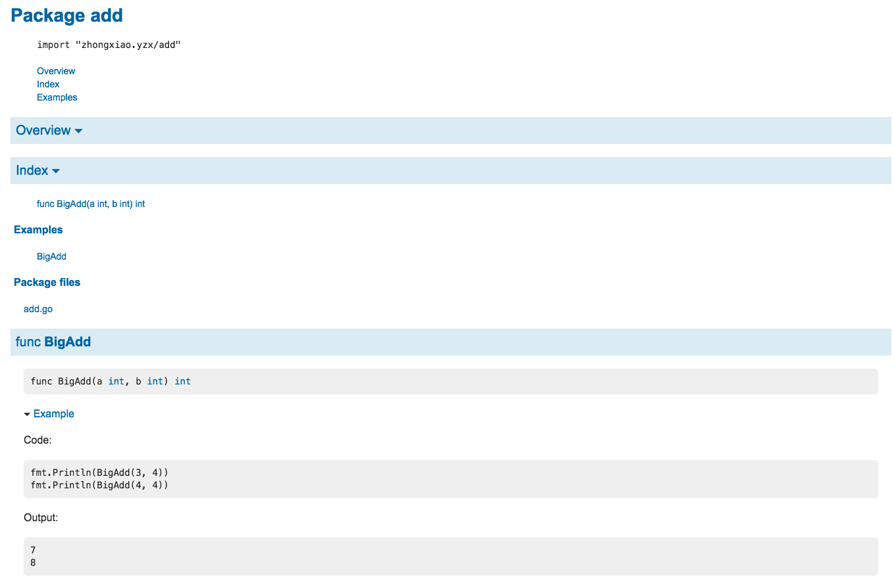
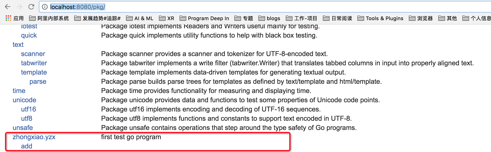

### Go语言概要

Go语言作为一门新兴的编程语言，其静态编译，原生的运行效率，并发支持优势，自动垃圾回收足以引起众多的追随者。甚至连Node之父Ryan Dahl[1]都着手基于Go来构建deno项目以解决Node设计的缺陷。

接下来我们会尝试通过如下几个部分来起步Go语言程序设计:
1. Go语言程序起步
2. Go语言数据结构
3. Go常见并发模型及同步
4. 异常及其使用
4. 反射&unsafe高级主题

### Go语言起步
在进行Go语言具体内容学习之前，让我们以实际的程序一起来从整体上解下Go语言程序。

#### 1. Go语言程序结构
``` go
$GOPATH/
├── bin
│   ├── dlv
│   ├── gocode
│   ├── main
├── pkg
│   └── darwin_amd64
│       ├── github.com
│       │   └── peterh
│       └── zhongxiao.yzx
│           └── add.a
└── src
    ├── github.com
    │   ├── peterh
    │   │   └── liner
    └── zhongxiao.yzx
        ├── add
        |   ├── example_test.go
        │   └── add.go
        └── test
        |   ├── benchmark_test.go
        |   └── ut_test.go
        └── main.go
```
如上所以的Go程序结构以$GOPATH为根目录，对应的工作区目录有三个子目录。
- pkg 子目录主要用于保存编译后的目标文件,例如第三方插件github.com/peterh和定义zhongxiao.yzx/add.a
- bin 子目录用于保存编译后的可执行程序，例如第三方插件dlv(vscode debugger插件)，gocode以及自定义可执行程序main

- src 子目录用于存储源代码。每个包被保存在与$GOPATH/src的相对路径为包导入路径的子目录中，例如第三方插件包github.com/peterh相对应的路径目录；自定义开发目录zhongxiao.yzx下有2个子包add， test分别放置自定义和测试程序。
main.go
``` go
// main.go
package main

import (
	"fmt"
	"zhongxiao.yzx/add"
)

func main() {
	a, b := 3, 4
	result := add.BigAdd(3, 4)
	fmt.Printf("%d + %d = %d", a, b, result)
}
```
add.go
```go
package add

func BigAdd(a int, b int) int {
	return a + b
}

```
example_test.go
```go
package add

import (
	"fmt"
)

func ExampleBigAdd() {
	fmt.Println(BigAdd(3, 4))
	fmt.Println(BigAdd(4, 4))
	// Output:
	// 7
	// 8
}
```

ut_test.go
``` go
package test

import (
	"testing"
	"zhongxiao.yzx/add"
)

func Test_BigAdd(t *testing.T) {
	a, b := 3, 3
	result := add.BigAdd(a, b)
	if 6 != result {
		t.Errorf("%d + %d = %d %d expected", a, b, result, 6)
	}
}
```

benchmark_test.go
```go
package test

import (
	"fmt"
	"testing"

	"zhongxiao.yzx/add"
)

func Benchmark_BigAdd(b *testing.B) {
	fmt.Println("Benchmark_Test")
	for i := 0; i < b.N; i++ {
		add.BigAdd(i, i)
	}
}
```

一个Go语言编写的程序对应一个或多个以.go为文件后缀名的源文件中。
1. 每个源文件以包的声明语句开始，说明该源文件是属于哪个包。
2. 包声明语句之后是import语句导入依赖的其它包，
3. 然后是包一级的类型、变量、常量、函数的声明语句(<font color=red>包一级的各种类型的声明语句的顺序无关紧要，但是函数内部的名字则必须先声明之后才能使用）</font>。
	- 在包一级声明语句声明的名字可在整个包对应的每个源文件中访问，而不是仅仅在其声明语句所在的源文件中访问。
	- 局部声明的名字就只能在函数内部很小的范围被访问


#### 2. Go工程编译，运行, 测试
构造以上的Go工程，进入自定义包目录zhongxiao.yzx，通过如下的命令和过程我们可以编译，运行及测试Go程序。
- go build  
  构建指定的包和它依赖的包，然后丢弃除了最后的可执行文件之外所有的中间编译结果。
  如果包的名字是main, go build 将调用连接器在当前目录创建一个可执行程序；如果包是一个库, 则忽略输出结果，以导入路径的最后一段作为目标产物名字。
- go install
  与go build命令很相似，但是它会保存每个包的编译成果，而不是将它们都丢弃。被编译的包会被保存到$GOPATH/pkg目录下，目录路径和 src目录路径对应; 可执行程序被保存到$GOPATH/bin目录。go install 命令和 go build 命令都不会重新编译没有发生变化的包，这可以使后续构建更快捷。  
  为了方便编译依赖的包， <font color="red">**go build -i**</font> 命令将安装每个目标所依赖的包。
- go run
  在zhongxiao.yzx目录下执行 go run main.go 即可运行测试程序。
- go test  
  go test命令会遍历所有的*_test.go文件中符合上述命名规则的函数，然后生成一个临时的main包用于调用相应的测试函数，然后构建并运行、报告测试结果，最后清理测试中生成的临时文件。  
  采用如上所示工程作为go test示例，包目录内所有以<font color="red">\*_test.go</font>为后缀名的源文件并不是go build构建包的一部分，它们是go test测试的一部分。
  在*_test.go文件中，有三种类型的函数：  
	1. 测试函数  
	一个测试函数是以<font color="red">**Test**</font>为函数名前缀的函数，用于测试程序的一些逻辑行为是否正确；go test命令会调用这些测试函数并报告测试结果是PASS或FAIL。在zhongxiao.yzx/test目录下执行如下的命令可以运行测试函数
		``` go
		go test -coverprofile=c.out //运行test并生成覆盖率profile  
		go tool cover -html=c.out // c.out profile生成html```
		```

	2. 基准测试函数  
	基准测试函数是以<font color="red">**Benchmark**</font>为函数名前缀的函数，它们用于衡量一些函数的性能；go test命令会多次运行基准函数以计算一个平均的执行时间。
	在zhongxiao.yzx/test目录下执行
		``` go
		go test -bench=. // 执行基准测试
		```
    默认情况下不运行任何基准测试。需要通过 -bench 命令行标志参数手工指定要运行的基准测试函数。该参数是一个正则表达式，用于匹配要执行的基准测试函数的名字，默认值是空的。其中“.”模式将可以匹配所有基准测试函数，但是这里总共只有一个基准测试函数。

	3. 示例函数  
	示例函数是以<font color="red">**Example**</font>为函数名前缀的函数，提供一个由编译器保证正确性的示例文档。
		```
		func ExampleBigAdd() {
			fmt.Println(BigAdd(3, 4))
			fmt.Println(BigAdd(4, 4))
			// Output:
			// 7
			// 8
		}
		```
	- 根据示例函数的后缀名部分，godoc的web文档会将一个示例函数关联到某个具体函数或包本身，因此ExampleBigAdd示例函数将是BigAdd函数文档的一部分，Example示例函数将是包文档的一部分。
	

	- 示例文档的第二个用处是在 go test 执行测试的时候也运行示例函数测试。如果示例函数内含有类似上面例子中的 // Output: 格式的注释，那么测试工具会执行这个示例函数，然后检测这个示例函数的标准输出和注释是否匹配。


### 3 Go语言包组织及使用
从上面的示例程序，包是组织Go语言工程的基本单元。Go语言中的包和其他语言的库或模块的概念类似，目的都是为了支持模块化、封装、单独编译和代码重用。一个包的源代码保存在一个或多个以.go为文件后缀名的源文件中，通常一个包所在目录路径的后缀是包的导入路径；例如包gopl.io/ch1/helloworld对应的目录路径是
$GOPATH/src/**gopl.io/ch1/helloworld**。  
- 每个包都对应一个独立的名字空间
- 包还可以让我们通过控制哪些名字是外部可见的来隐藏内部实现信息。在Go语言中，一个简单的规则是：如果一个名字是大写字母开头的，那么该名字是导出的
- 在每个源文件的包声明前仅跟着的注释是包注释。通常，包注释的第一句应该先是包的功能概要说明。一个包通常只有一个源文件有包注释（译注：如果有多个包注释，目前的文档工具会根据源文件名的先后顺序将它们链接为一个包注释）。如果包注释很大，通常会放到一个独立的doc.go文件中。
- 在Go语言程序中，每个包都是有一个全局唯一的导入路径，一个导入路径代表一个目录中的一个或多个Go源文件，按照惯例，一个包的名字和包的导入路径的最后一个字段相同，例如gopl.io/ch2/tempconv包的名字一般是tempconv。
即使两个包的导入路径不同，它们依然可能有一个相同的包名。例如，math/rand包和crypto/rand包的包名都是rand。
- 包的初始化   
Go可以用一个特殊的init初始化函数来执行包的初始化工作。每个文件都可以包含多个init初始化函数。   
``` func init() { /* ... */ } ```  
这样的init初始化函数除了不能被调用或引用外，其他行为和普通函数类似。在每个文件中的init初始化函数，在程序开始执行时按照它们声明的顺序被自动调用。   
每个包在解决依赖的前提下，以导入声明的顺序初始化，每个包只会被初始化一次。

- 导入声明
``` go
import (
	"crypto/rand"
	mrand "math/rand" // alternative name mrand avoids conflict
	import _ "image/png" // 匿名导入 register PNG decoder
)
```
如果我们想同时导入两个有着名字相同的包，例如math/rand包和crypto/rand包，那么导入声
明必须至少为一个同名包指定一个新的包名以避免冲突。  
导入包的重命名只影响当前的源文件。其它的源文件如果导入了相同的包，可以用导入包原本默认的名字或重命名为另一个完全不同的名字。
如果只是导入一个包而并不使用导入的包将会导致一个编译错误。有时候我们只是想利
用导入包计算包级变量的初始化表达式和执行导入包的init初始化函数, 我们可以用下划线 _ 来重命名
导入的包。这个被称为包的匿名导入。它通常是用来实现一个编译时机制，然后通过在main主程序入口
选择性地导入附加的包。
``` go
import (
	"database/sql"
	_ "github.com/lib/pq" // enable support for Postgres
	_ "github.com/go-sql-driver/mysql" // enable support for MySQL
)
db, err = sql.Open("postgres", dbname) // OK
db, err = sql.Open("mysql", dbname) // OK
db, err = sql.Open("sqlite3", dbname) // returns error: unknown driver "sqlite3"
```

- 特殊包及其导入路径
1. 包对应一个可执行程序，也就是main包，这时候main包本身的导入路径是无关紧要的。名字为main的包是给go build（§10.7.3）构建命令一个信息，这个包编译完之后必须调用连接器生成一个可执行程序。
2. 包所在的目录中可能有一些文件名是以test.go为后缀的Go源文件（前面
必须有其它的字符，因为以`test`前缀的源文件是被忽略的），并且这些源文件声明的包名也是以_test为后缀名的。所有以_test为后缀包名的测试外部扩展包都由go test命令独立编译。
3. 一些依赖版本号的管理工具会在导入路径后追加版本号信息，例如"gopkg.in/yaml.v2"。这种情况下包的名字并不包含版本号后缀，而是yaml。
4. 内部包
Go语言的构建工具对包含internal名字的路径段的包导入路径做了特殊处理。这种包叫internal包，一个internal包只能被和internal目录有同一个父目录的包所导入。例如，net/http/internal/chunked内部包只能被net/http/httputil或net/http包导入，但是不能被net/url包导入。
   


### Go异常
- panic

Go的类型系统会在编译时捕获很多错误，但有些错误只能在运行时检查，如数组访问越界、空指针引用等。这些运行时错误会引起painc异常。  
直接调用内置的panic函数也会引发panic异常；panic函数接受任何值作为参数(在Go的panic机制中，延迟函数的调用在释放堆栈信息之前)
- recover
如果在deferred函数中调用了内置函数recover，并且定义该defer语句的函数发生了panic异常，recover会使程序从panic中恢复，并返回panic value。导致panic异常的函数不会继续运行，但能正常返回。在未发生panic时调用recover，recover会返回nil。
``` go
func panicRecover() (err error) {
	type bailout struct{}
	defer func() {
		p := recover()
		log.Printf("%v", p)
		switch p {
		case nil: // no panic
		case bailout{}: // "expected" panic
			err = fmt.Errorf("multiple title elements")
		default:
			panic(p) // unexpected panic; carry on panicking
		}
	}()
	log.Printf("panicRecover before panic")
	panic(bailout{})
	log.Printf("panicRecover after panic")
	return err
}
```

### 并发


### godoc文档的生成
``` go
$GOPATH/
    └── zhongxiao.yzx
        ├── add
        |   ├── example_test.go
        │   └── add.go
        └── test
            ├── benchmark_test.go
            └── ut_test.go
```
在Go语言中，Go为我们提供了快速生成文档以及查看文档的工具，让我们可以很容易的编写查看文档。
Go提供了两种查看文档的方式，一种是使用go doc命令在终端查看。

zhongxiao.yxz@MacBook-Pro:~/Workspace/dev/golang/src/zhongxiao.yzx$go doc zhongxiao.yzx/add
``` html
package add // import "zhongxiao.yzx/add"

func BigAdd(a int, b int) int
```
或者通过godoc命令查看
zhongxiao.yzx@MacBook-Pro:~/Workspace/dev/golang/src/zhongxiao.yzx$godoc cmd/zhongxiao.yzx/add
``` html
PACKAGE DOCUMENTATION

package add
    import "."


FUNCTIONS

func BigAdd(a int, b int) int
```

第二种方式，是使用浏览器查看的方式，通过godoc命令可以在本机启动一个web服务，
zhongxiao.yzx@MacBook-Pro:~/Workspace/dev/golang/src/zhongxiao.yzx$godoc -http=:8080

godoc -http参数指定Web服务监听的IP和Port，运行后，我们就可以打开浏览器，输入http://localhost:8080/pkg/进行访问了。
如下图所以，你会发现打开的页面，和GoLang的官方网站一样，但是文档中增加了本地的包，这些包是基于本地GOROOT和GOPATH这两个路径下的所有包生成的文档。


示例程序中zhongxiao.yzx/add下有如下2个文件

add.go
```
package add

func BigAdd(a int, b int) int {
	return a + b
}
```

example_test.go
```
func ExampleBigAdd() {
    fmt.Println(BigAdd(3, 4))
    fmt.Println(BigAdd(4, 4))
    // Output:
    // 7
    // 8
}
```
godoc工具根据example_test.go示例程序，将一个示例函数关联到某个具体函数或包本身，因此ExampleBigAdd示例函数将是BigAdd函数文档的一部分，Example示例函数将是包文档的一部分。(example_test.go必须以_test.go作为后缀，否则go工具会将该文件作为普通的文件对待，详见go test测试部分内容)


[1]: [ry/deno : https://github.com/ry/deno](https://github.com/ry/deno)

[2]: [The Go Programming Language : https://golang.org/](https://golang.org/)

[3]: [The Go Programming Language : http://www.gopl.io/](http://www.gopl.io/)

[4]: [Go Packages : https://godoc.org/](https://godoc.org/)


